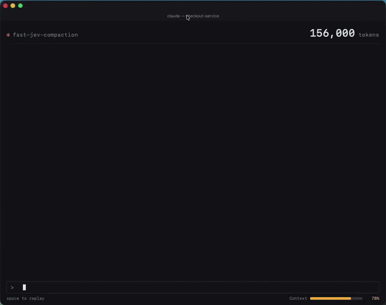

# pi-jev-compaction

A [Pi](https://github.com/badlogic/pi-mono) extension for context compaction.
It uses `fast-jev-compaction@0.4.0` for Jev's tool-call decisions and adapts
those decisions to Pi's native message and compaction lifecycle.

The `0.4.0` dependency is the
[`aleksvega/fast-jev-compaction`](https://github.com/aleksvega/fast-jev-compaction)
fork based on
[`tamaratran/fast-jev-compaction`](https://github.com/tamaratran/fast-jev-compaction).
This project is a **Pi adapter**, not a replacement for Pi's compaction system:
Jev decides which eligible tool calls and results to keep, drop, or shorten;
Pi still creates the summary, compaction entry, file-operation details, and
retained recent context.

## Demo



Video source: [Tamara Tran's post on X](https://x.com/tamarajtran/status/2100694549362553153).
The GIF is included as demonstration material; all rights remain with the
original author.

## How it works

For both manual `/compact` and automatic compaction:

```text
Pi prepares a compaction
        |
        v
session_before_compact
        |
        v
Jev reviews eligible tool call/result pairs
        |
        +-- success --> replace only the two native message arrays
        |                 |
        |                 v
        |            Pi's native compact()
        |
        +-- timeout/error/invalid response --> leave preparation unchanged
                                              |
                                              v
                                         Pi's native compact()
```

Rather than serializing Jev's simplified transcript back into Pi, the adapter
maps Jev's decisions onto the original Pi messages. Pi's thinking blocks,
images, tool-call metadata, and other native message data therefore remain
native in the final preparation.

The adapter only modifies:

- `messagesToSummarize`
- `turnPrefixMessages`

All other compaction metadata remains owned by Pi and is never touched by this
extension, including:

- `firstKeptEntryId`
- `tokensBefore`
- `previousSummary`
- `fileOps`
- `settings`
- `isSplitTurn`

Pi computes some of this metadata before the hook runs. Consequently, if Jev
removes an old `write` or `edit` call, `fileOps` may still describe that call;
the extension does not recalculate Pi's native metadata.

### What can be filtered

Only paired, text-only tool calls and tool results within the same native
compaction input are eligible. `messagesToSummarize` and
`turnPrefixMessages` are processed independently; they are never combined for
Jev decisions. Pi's separately retained recent region and messages outside
these two arrays are not sent to Jev.

The adapter leaves the following native messages or content untouched:

- user and assistant prose;
- thinking blocks and image content in the original Pi messages;
- image-bearing tool results;
- incomplete or duplicate call/result pairs;
- pairs crossing the two native input boundaries;
- Pi's separately retained recent region;
- tool results without a valid matching call.

Ineligible tool results—unpaired results, duplicate IDs, image-bearing results,
or pairs crossing the two compaction inputs—are not converted into ordinary
user messages, and their text is excluded from Jev's temporary decision state.
The original Pi messages remain preserved.

A `drop_call` decision removes the call and its paired result. A `drop_result`
decision keeps the call. With the default `truncateHeadChars` of 300, a result
is shortened only when it is longer than 420 characters; shorter results stay
unchanged. Longer results keep their first 300 characters and receive a note.
Pi then summarizes the filtered native messages normally.

The `reviewed` count in notifications includes only tool calls actually queried
through Jev. It excludes calls kept by upstream protection rules (pinned) and
is not a count of questions or request batches.

## Compatibility

- Pi: best-effort compatibility, without an exact-version gate; development types remain pinned to `0.85.1`.
- Node.js `>=24`
- `fast-jev-compaction` `0.4.0`

An offline manual-compaction integration test passes with Pi `0.85.1` and
`0.87.1`. It uses simulated Jev decisions and summary-model responses to verify
that Pi consumes the filtered input and creates a native compaction entry.
This does not validate every model or automatic-compaction scenario.

A Pi upgrade no longer disables the extension solely because its version differs.
The extension checks that `session_before_compact` provides two replaceable
message arrays and a usable cancellation signal. If those checks fail, it warns
and skips Jev, leaving Pi to perform native compaction. Both fields are checked
again before writing results to avoid replacing only one input.

This does not guarantee compatibility with every Pi release. The adapter still
relies on Pi consuming the mutated preparation object, which is not a formally
documented API for replacing native compaction inputs. Structural checks cannot
detect every behavioral change. Changes to that lifecycle may require an adapter
update, but ordinary Pi releases do not inherently require one.

This package does not modify Pi's source code or call Pi's exported
`compact()` function itself.

## Installation

Install from Pi Package (npm):

```sh
pi install npm:@lienat/pi-jev-compaction
```

Install from the GitHub repository:

```sh
pi install git:github.com/Jul1en-Lin/pi-jev-compaction@main
```

Or install a local checkout for development:

```sh
pi install /Users/lien/prj/pi-fast-jev-compaction
```

Restart Pi after installation. Verify with:

```sh
pi list
```

To uninstall the GitHub version:

```sh
pi remove git:github.com/Jul1en-Lin/pi-jev-compaction
```

## Configuration

The extension reaches the official TypeSafe Jev endpoint through the upstream
package. Set the API key in the environment of the terminal that starts Pi:

```sh
export TYPESAFE_API_KEY='your-typesafe-key'
```

The key is read at runtime and used only to authenticate Jev requests. It is
never written to the package, Pi settings, session files, or extension logs.
Do not commit it or paste it into a shared shell history.

The Jev decision payload can include conversation text and tool input, which
may contain source code, file paths, commands, or other sensitive data. Only
use this extension if you are comfortable sending that information to TypeSafe.

### Timeout

`PI_FAST_JEV_TIMEOUT_MS` controls the total time allowed for one Jev attempt,
including both native preparation arrays. It defaults to 15 seconds:

```sh
export PI_FAST_JEV_TIMEOUT_MS=15000
```

If the API key is missing, the Pi compaction input is incompatible, Jev times out, the
request fails, or the response is invalid, the adapter prints a brief warning
and leaves the original preparation unchanged. Pi then runs its ordinary
native compaction. The extension never invokes `/compact` recursively.

When the user cancels a compaction, the cancellation signal is forwarded to
the Jev request and the native preparation is not replaced or modified.

## Development

Install dependencies without running lifecycle scripts:

```sh
npm install --ignore-scripts --no-audit --no-fund
```

Run the checks:

```sh
npm run typecheck
npm test
```

The integration test uses the project's installed Pi by default. To test another
installed Pi package, specify its directory (test-only; this does not configure
the extension):

```sh
npm run build
PI_TEST_HOST_PATH=/path/to/pi-coding-agent node --test dist/test/pi-host.test.js
```

This test does not contact Jev or a model service.

Build the package:

```sh
npm run build
```

Create a local npm tarball without publishing:

```sh
npm pack --ignore-scripts
```

## Acknowledgements and attribution

This adapter uses `fast-jev-compaction@0.4.0`, the
[`aleksvega/fast-jev-compaction`](https://github.com/aleksvega/fast-jev-compaction)
fork based on [`fast-jev-compaction`](https://github.com/tamaratran/fast-jev-compaction)
by [Tamara Tran](https://github.com/tamaratran). The upstream project provides
the Jev decision logic that this Pi adapter integrates with native Pi
compaction.

If you believe this repository contains material that infringes your rights,
or if the attribution needs to be corrected, please open an issue at
[github.com/Jul1en-Lin/pi-jev-compaction/issues](https://github.com/Jul1en-Lin/pi-jev-compaction/issues).
We will review the request and remove or revise the affected material where
appropriate.

## License

This adapter is released under the MIT License. Please also review the
upstream project's license and attribution requirements:
[`fast-jev-compaction`](https://github.com/tamaratran/fast-jev-compaction).
